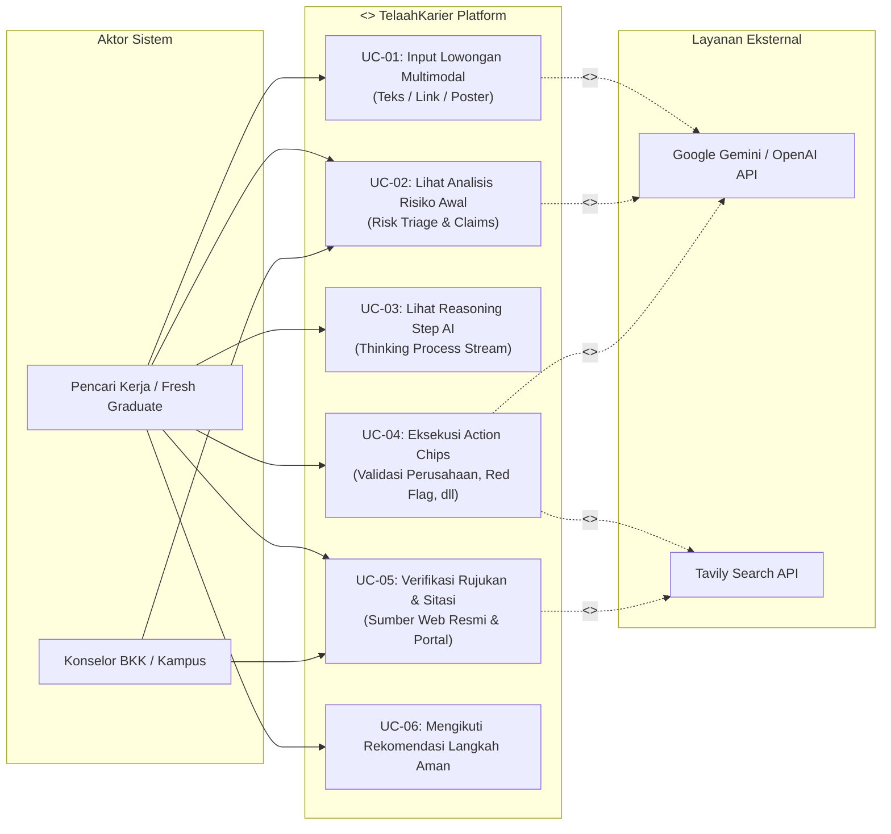
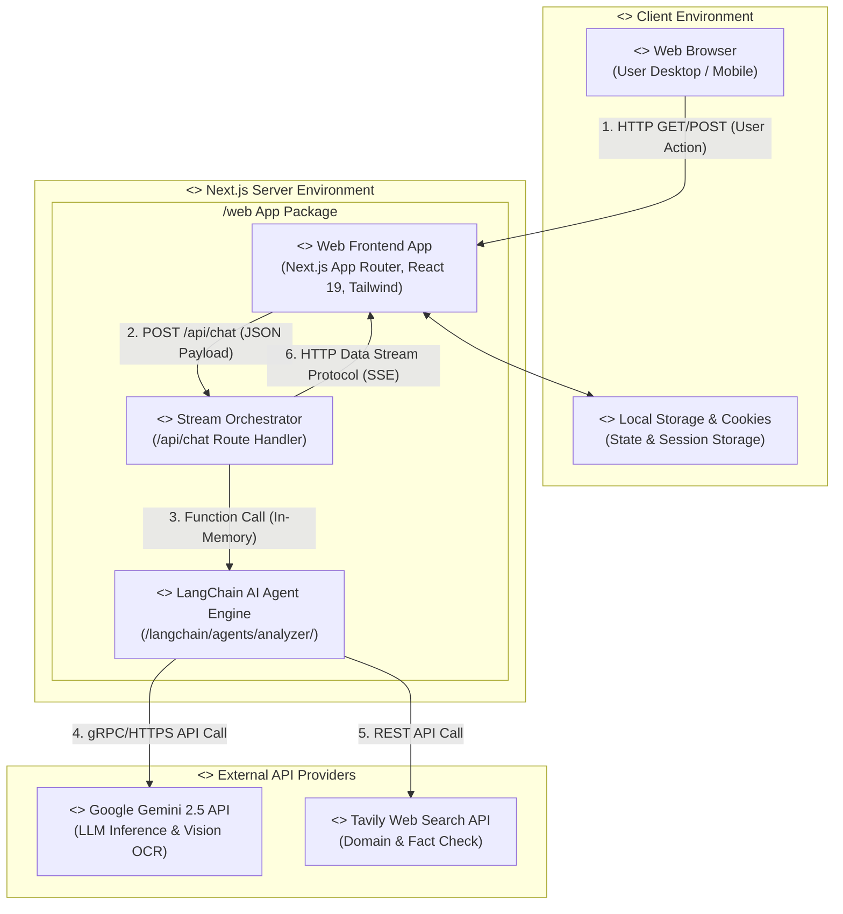
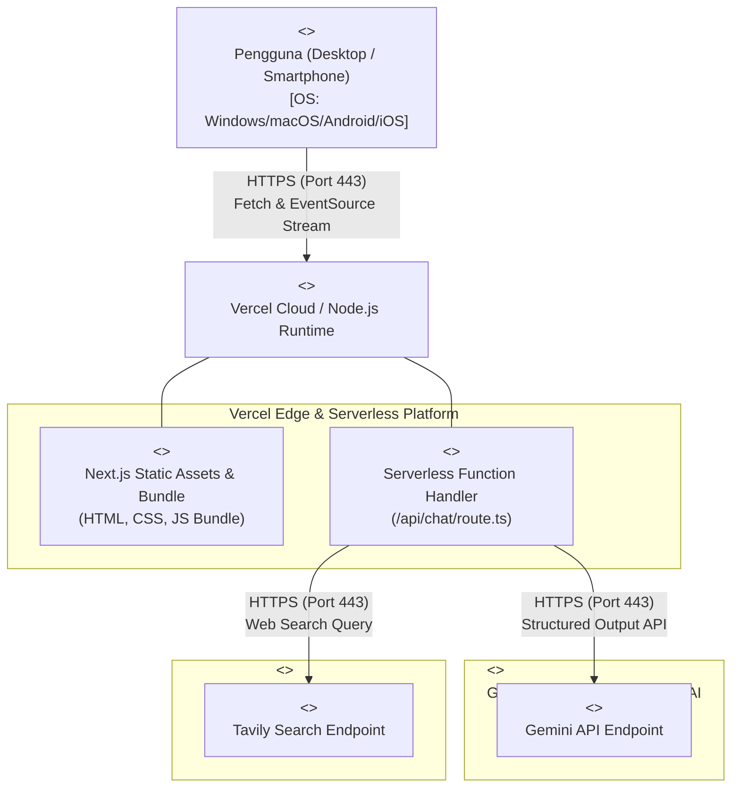
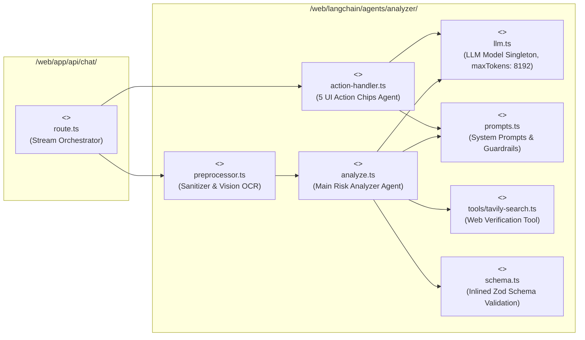
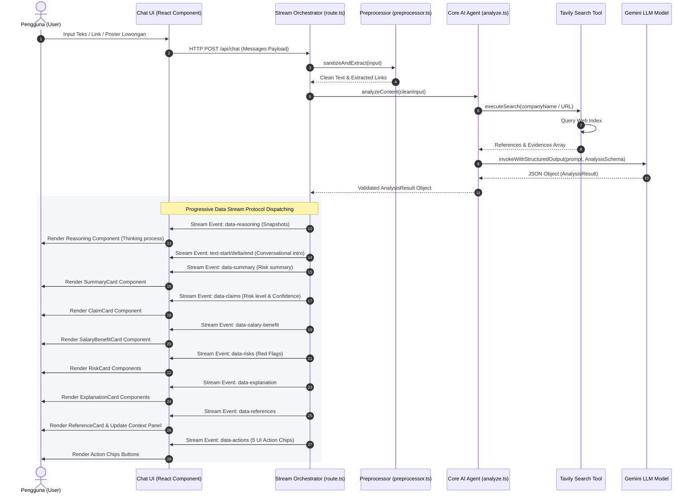
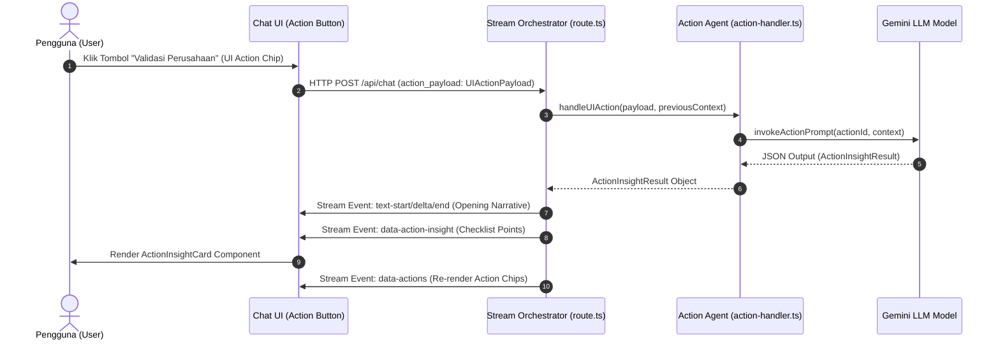
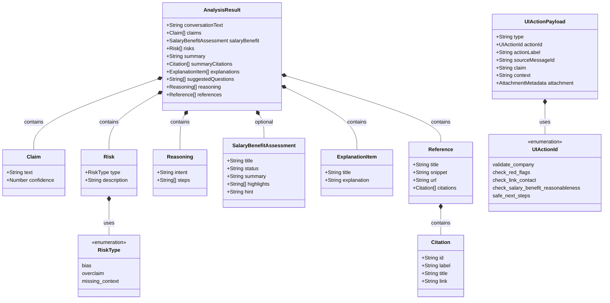

# DOKUMEN ARSITEKTUR C4 MODEL & DIAGRAM UML
## TelaahKarier — System Architecture & AI Engine Specification

| Atribut Dokumen | Detail |
|---|---|
| **Nama Sistem** | TelaahKarier (Platform AI Interaktif Analisis Risiko Lowongan Kerja) |
| **Paradigma Arsitektur** | C4 Model (Context, Container, Component, Code) & Standard UML |
| **Versi Dokumen** | 2.1.0 (Live Production & Fixed Schema Edition) |
| **Target Event** | GEMASTIK — Pengembangan Perangkat Lunak |
| **Penyusun** | Tim Kelaz king (Universitas Brawijaya) |
| **Status** | **Fully Implemented & Verified** |

---

# EXECUTIVE SUMMARY

Dokumen ini menyajikan arsitektur sistem **TelaahKarier** dengan menggabungkan **Paradigma C4 Model** dan notasi **UML (Unified Modeling Language)** standar. Seluruh diagram digambar menggunakan sintaks **Mermaid UML** yang kompatibel dengan GitHub, VS Code, dan platform dokumentasi teknis.

```
┌─────────────────────────────────────────────────────────────┐
│ LEVEL 1: C4 CONTEXT & UML USE CASE DIAGRAM                  │
│ Aktor, Batas Sistem, & Kasus Penggunaan Utama               │
└──────────────────────────────┬──────────────────────────────┘
                               │
┌──────────────────────────────▼──────────────────────────────┐
│ LEVEL 2: C4 CONTAINER & UML DEPLOYMENT DIAGRAM              │
│ Node Komputasi, Aplikasi Web, API Route, & External APIs    │
└──────────────────────────────┬──────────────────────────────┘
                               │
┌──────────────────────────────▼──────────────────────────────┐
│ LEVEL 3: C4 COMPONENT & UML SEQUENCE DIAGRAM                │
│ Komponen Internal AI Engine & Alur Interaksi Pesan          │
└──────────────────────────────┬──────────────────────────────┘
                               │
┌──────────────────────────────▼──────────────────────────────┐
│ LEVEL 4: C4 CODE & UML CLASS DIAGRAM                        │
│ Struktur Kelas, Type Definition, & Zod Schemas              │
└─────────────────────────────────────────────────────────────┘
```

---

# LEVEL 1: SYSTEM CONTEXT & UML USE CASE DIAGRAM

## 1.1 Context System Overview
Platform **TelaahKarier** berfungsi sebagai workspace kecerdasan buatan (*AI Workspace*) untuk mengevaluasi risiko penipuan lowongan kerja digital.

## 1.2 UML Use Case Diagram

Diagram Use Case UML menggambarkan aktor pengguna dan kasus penggunaan (*use cases*) utama di dalam sistem TelaahKarier:



---

# LEVEL 2: C4 CONTAINER & UML DEPLOYMENT DIAGRAM

Level 2 memetakan bagaimana kontainer aplikasi dipetakan ke dalam node infrastruktur dan *deployment environment*.

## 2.1 UML Component Architecture Diagram (Level 2 Containers)



## 2.2 UML Deployment Diagram

Diagram Penyebaran (*Deployment Diagram*) menggambarkan simpul fisik komputasi saat aplikasi berjalan di lingkungan produksi (Vercel / Cloud Run):



---

# LEVEL 3: C4 COMPONENT & UML SEQUENCE DIAGRAM

Level 3 menyajikan alur interaksi internal antar-komponen AI Engine saat memproses analisis lowongan kerja dan aksi pengguna.

## 3.1 UML Component Diagram (AI Engine Internal)



## 3.2 UML Sequence Diagram: End-to-End Chat & Analysis Flow



## 3.3 UML Sequence Diagram: UI Action Chip Click Flow



---

# LEVEL 4: C4 CODE & UML CLASS DIAGRAM

Level 4 menyajikan arsitektur tipe data, skema validasi, dan keterhubungan antar-kelas/skema Zod di tingkat kode.

## 4.1 UML Class Diagram (Inlined Schemas & Data Models)



---

# BAB 5: RANGKUMAN KEPATUHAN UML & C4

Dokumen spesifikasi arsitektur berbasis **UML dan C4 Model** ini menjamin:

1. **Kejelasan Hubungan System Context**: Pengguna dan layanan cloud eksternal terhubung secara transparan melalui protokol HTTPS standar.
2. **Fleksibilitas Kontainer (Level 2)**: Next.js App Router bertindak sebagai pembungkus (*wrapper*) stateless yang siap di-scale ke lingkungan cloud modern.
3. **Ketegasan Komponen Internal AI (Level 3)**: Pemisahan tugas antara `route.ts`, `preprocessor.ts`, `analyze.ts`, `schema.ts`, dan `action-handler.ts` memastikan kode bersih (*Clean Code*) dan ter-inlined untuk kompatibilitas penuh Gemini API.
4. **Validasi Tipe Data Tanpa Celah (Level 4)**: Seluruh pemancaran stream terikat pada Zod Schema yang menjamin antarmuka React tidak akan mengalami error tipe data saat merender kartu analisis.
