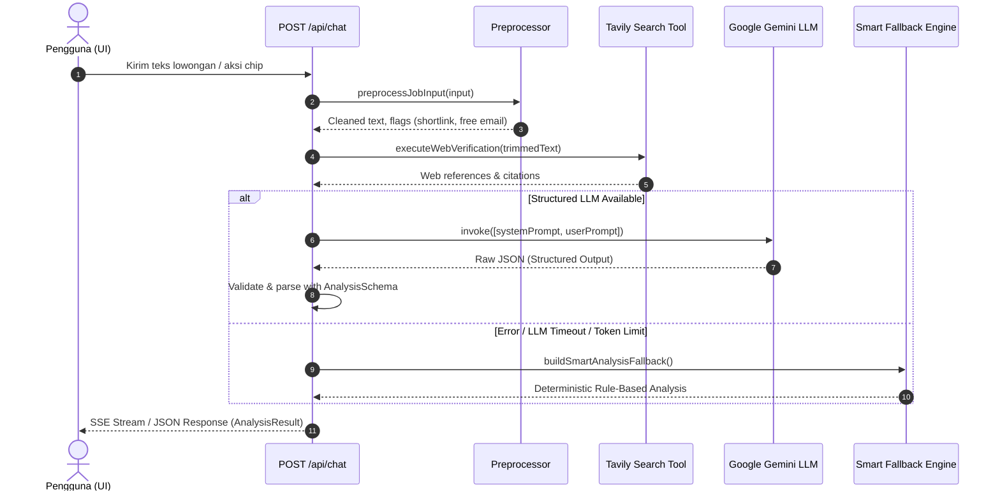

# 🔄 02. AI Processing Workflow & Pipeline

Dokumen ini menjelaskan alur kerja sekuensial (end-to-end processing pipeline) saat pengguna mengirimkan materi lowongan kerja ke TelaahKarier.

---

## 🔁 1. Alur Eksekusi Utama (Primary Flow)

---

## 📋 2. Rincian Tahapan Pipeline

### Tahap 1: Preprocessing (`preprocessor.ts`)
1. **Sanitasi Teks**: Menghapus karakter khusus berbahaya dan spasi berlebih.
2. **Pemeriksaan Pola**:
   - Mendeteksi *shortlink* (`bit.ly`, `tinyurl.com`, `wa.me`).
   - Mendeteksi domain email gratisan/non-korporat (`@gmail.com`, `@yahoo.com`, `@hotmail.com`).
   - Ekstraksi nama domain utama jika ada URL website yang dicantumkan.

### Tahap 2: Verifikasi Web Real-time (`tavily-search.ts`)
1. Jika teks lowongan mencantumkan nama perusahaan atau domain, sistem menjalankan pencarian web via **Tavily Search API**.
2. Mengambil 3 referensi web teratas (link resmi, halaman LinkedIn, atau artikel berita) beserta cuplikan (*snippet*).
3. Referensi ini nantinya digabungkan ke dalam field `references` pada respons akhir.

### Tahap 3: Pemanggilan LLM & Structured Output (`analyze.ts`)
1. `getLLMModel()` mengambil instance `ChatGoogleGenerativeAI`.
2. Menggunakan method `.withStructuredOutput(AnalysisSchema)` untuk memaksa model mengembalikan JSON yang sesuai dengan Zod schema.
3. Prompt dikirimkan gabungan antara `analyzerSystemPrompt` dan `analyzerInputPrompt`.

### Tahap 4: Fallback Otomatis (`buildSmartAnalysisFallback`)
1. Jika koneksi API gagal, API Key tidak valid, atau struktur JSON rusak, sistem tidak akan crash.
2. `try-catch` block akan menangkap error dan mengalihkan proses ke `buildSmartAnalysisFallback()`.
3. Fallback engine menggunakan aturan deterministik berdasarkan flag preprocessor (misal: jika ada shortlink & kata "biaya", tingkat risiko di-set "Tinggi").
